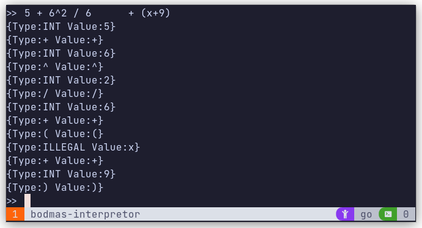

# What is BODMAS?

BODMAS stands for Brackets, Orders, Division Multiplication, Addition Subtraction.
It is the order of operations to be followed to evaluate simple mathematical expression.

For example: `(2 + 4) * 3 / 6 - 1 = 2`

# Tokens

